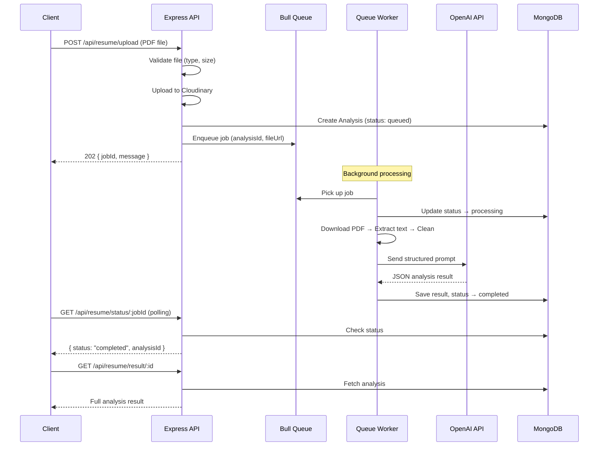
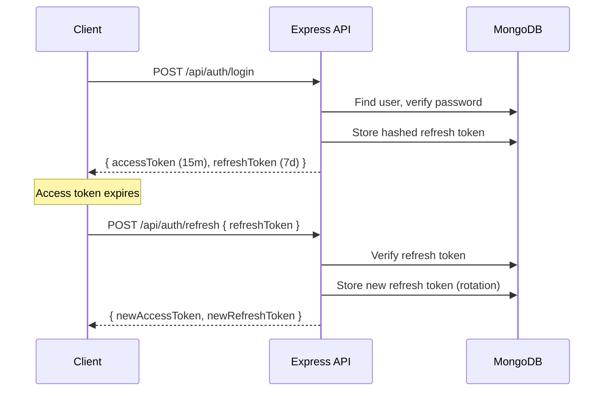

# AI Resume Analyzer — Refactoring Walkthrough

## Summary

Refactored the AI Resume Analyzer backend from an MVP into a production-grade system. **33 source files** across **11 directories** — 14 new files, 19 modified files.

---

## Architecture: Before vs After

### Before (Flat MVP)
```
Routes → Controllers (fat, mixed DB + business logic) → Services → MongoDB
```

### After (Layered Production)
```
Routes → Middleware (validation, auth, rate limit)
       → Controllers (thin req/res only)
       → Services (business logic)
       → Repositories (DB operations)
       → MongoDB

       + Bull Queue → Worker → AI Service (background)
```

---

## What Changed (by category)

### 1. ⚡ Async Processing with BullMQ
**The single biggest improvement.** Resume uploads no longer block the HTTP request for 10-30 seconds.

- **Before**: `POST /upload` → wait for AI → respond (10-30s)
- **After**: `POST /upload` → enqueue → respond instantly (202 Accepted, ~50ms) → worker processes in background → client polls `GET /status/:jobId`

| File | Purpose |
|------|---------|
| [resumeQueue.js](file:///Users/swapnil/AI_Resume_Anlyzer_Backend/src/queues/resumeQueue.js) | BullMQ queue definition with retry config |
| [resumeWorker.js](file:///Users/swapnil/AI_Resume_Anlyzer_Backend/src/queues/resumeWorker.js) | Background processor: extract → clean → AI → save |
| [redis.js](file:///Users/swapnil/AI_Resume_Anlyzer_Backend/src/config/redis.js) | Redis connection for BullMQ |

### 2. 🧠 AI Service Optimization
**3× cost and latency reduction** — single comprehensive AI call replaces 3 separate calls.

| Before | After |
|--------|-------|
| `analyzeResume()` + `extractSkills()` + `scoreResume()` = 3 API calls | Single `analyzeResume()` = 1 API call |
| No retry logic | 3 retries with exponential backoff |
| No timeout | Configurable timeout (default 30s) |
| Basic prompts | Structured prompt engineering with JSON schema |
| No response validation | Validates required fields, fills defaults |

Changed file: [aiService.js](file:///Users/swapnil/AI_Resume_Anlyzer_Backend/src/services/aiService.js)

### 3. 🏗️ Repository Layer (NEW)
All database operations extracted from controllers into dedicated repositories.

| File | Operations |
|------|-----------|
| [userRepository.js](file:///Users/swapnil/AI_Resume_Anlyzer_Backend/src/repositories/userRepository.js) | findByEmail, findById, create, updateRefreshToken |
| [analysisRepository.js](file:///Users/swapnil/AI_Resume_Anlyzer_Backend/src/repositories/analysisRepository.js) | create, findById, findByJobId, findByUserId (paginated), updateStatus, markCompleted, markFailed, deleteById |

### 4. 🔐 JWT Refresh Token Authentication
Proper token rotation pattern for secure long-lived sessions.

| Feature | Implementation |
|---------|---------------|
| Access token | 15 min expiry (short-lived) |
| Refresh token | 7 day expiry, hashed in DB, rotated on each use |
| Token theft detection | If reused refresh token detected → invalidate all tokens |
| Logout | Clears refresh token from DB |

Changed file: [authService.js](file:///Users/swapnil/AI_Resume_Anlyzer_Backend/src/services/authService.js)

### 5. 📊 Database Optimization

**User model** ([User.js](file:///Users/swapnil/AI_Resume_Anlyzer_Backend/src/models/User.js)):
- `password: { select: false }` — never returned by default
- `refreshToken` field (hashed)
- `timestamps: true` — auto createdAt/updatedAt

**Analysis model** ([Analysis.js](file:///Users/swapnil/AI_Resume_Anlyzer_Backend/src/models/Analysis.js)):
- `status` field with enum (queued → processing → extracting → analyzing → completed/failed)
- `jobId` for queue tracking
- `fileMetadata` (originalName, fileSize, mimeType, fileUrl)
- `processingTimeMs` for performance tracking
- Structured `aiResult` with typed sub-fields
- **Indexes**: `{ userId: 1, createdAt: -1 }`, `{ jobId: 1 }`, `{ status: 1 }`

### 6. 🚨 Custom Error Classes
All in [src/errors/](file:///Users/swapnil/AI_Resume_Anlyzer_Backend/src/errors/):

| Class | Status | Use Case |
|-------|--------|----------|
| `AppError` | base | All custom errors extend this |
| `ValidationError` | 400 | Invalid input, with field-level details |
| `UnauthorizedError` | 401 | Auth failures |
| `ForbiddenError` | 403 | Permission denied |
| `NotFoundError` | 404 | Resource not found |

The [error middleware](file:///Users/swapnil/AI_Resume_Anlyzer_Backend/src/middleware/errorMiddleware.js) also handles Mongoose CastError, ValidationError, duplicate key (11000), JWT errors, and Multer file size errors.

### 7. 🛡️ Tiered Rate Limiting

| Limiter | Max Requests | Applied To |
|---------|-------------|-----------|
| `apiLimiter` | 100 / 15 min | All `/api` routes |
| `authLimiter` | 10 / 15 min | Login, Signup |
| `uploadLimiter` | 5 / 15 min | Resume upload, Job match |

### 8. 📋 Request Logging
New [requestLogger middleware](file:///Users/swapnil/AI_Resume_Anlyzer_Backend/src/middleware/requestLogger.js) — logs method, URL, status, response time, IP, and userId for every request. Log level varies by status code (info/warn/error).

### 9. ✅ Input Validation
New [validateRequest middleware](file:///Users/swapnil/AI_Resume_Anlyzer_Backend/src/middleware/validateRequest.js) — generic factory that creates Express middleware from any Joi schema. Applied to all auth and resume endpoints.

---

## New API Reference

### Auth Endpoints
```
POST   /api/auth/signup      → Register (validated: name, email, password)
POST   /api/auth/login       → Login → { accessToken, refreshToken }
POST   /api/auth/refresh     → Exchange refresh token → new token pair
POST   /api/auth/logout      → Invalidate refresh token [AUTH]
GET    /api/auth/profile     → User profile [AUTH]
```

### Resume Endpoints (all require AUTH)
```
POST   /api/resume/upload          → Upload + enqueue → 202 { jobId }
POST   /api/resume/job-match       → Upload + JD + enqueue → 202 { jobId }
GET    /api/resume/status/:jobId   → Poll processing status
GET    /api/resume/result/:id      → Get completed analysis
GET    /api/resume/history?page=1&limit=10  → Paginated history
DELETE /api/resume/:id             → Delete analysis
```

---

## Final Folder Structure

```
AI_Resume_Anlyzer_Backend/
├── server.js                          # Entry point, graceful startup/shutdown
├── package.json                       # v2.0.0, new deps
├── .env.example                       # All env vars documented
├── .gitignore                         # Updated
└── src/
    ├── app.js                         # Express setup, middleware, routes
    ├── config/
    │   ├── database.js                # MongoDB connection + retry
    │   ├── environment.js             # Env validation + typed config
    │   └── redis.js                   # Redis connection for BullMQ
    ├── controllers/
    │   ├── authController.js          # Thin: signup, login, refresh, logout, profile
    │   └── resumeController.js        # Thin: upload, jobMatch, status, result, history, delete
    ├── errors/
    │   ├── AppError.js                # Base error class
    │   ├── ForbiddenError.js          # 403
    │   ├── NotFoundError.js           # 404
    │   ├── UnauthorizedError.js       # 401
    │   └── ValidationError.js         # 400
    ├── middleware/
    │   ├── authMiddleware.js          # JWT verification
    │   ├── errorMiddleware.js         # Centralized error handler
    │   ├── rateLimitMiddleware.js     # 3 tiers: api, auth, upload
    │   ├── requestLogger.js           # Request logging with timing
    │   ├── uploadMiddleware.js        # Multer + Cloudinary (PDF/DOC/DOCX)
    │   └── validateRequest.js         # Generic Joi validation factory
    ├── models/
    │   ├── Analysis.js                # Enhanced with status, jobId, metadata, indexes
    │   └── User.js                    # Enhanced with refreshToken, timestamps
    ├── queues/
    │   ├── resumeQueue.js             # BullMQ queue definition
    │   └── resumeWorker.js            # Background processor
    ├── repositories/
    │   ├── analysisRepository.js      # All Analysis DB operations
    │   └── userRepository.js          # All User DB operations
    ├── routes/
    │   ├── authRoutes.js              # Auth endpoints with validation
    │   └── resumeRoutes.js            # Resume endpoints with rate limits
    ├── services/
    │   ├── aiService.js               # Single-call AI with retry + timeout
    │   ├── authService.js             # Auth business logic + token rotation
    │   ├── pdfService.js              # Text extraction + cleaning pipeline
    │   └── resumeService.js           # Resume orchestration + queue management
    ├── utils/
    │   ├── cloudinary.js              # Cloudinary config (unchanged)
    │   └── logger.js                  # Enhanced Winston with rotation
    └── validation/
        ├── authValidation.js          # Signup, login, refresh schemas
        └── resumeValidation.js        # Job match, history query schemas
```

---

## Setup Instructions

### 1. Environment Variables
```bash
cp .env.example .env
# Edit .env with your actual values
```

### 2. Redis (Required for queue system)
```bash
# Option A: Local Redis (macOS)
brew install redis
brew services start redis

# Option B: Docker
docker run -d -p 6379:6379 redis:alpine
```

Add to `.env`:
```
REDIS_URL=redis://localhost:6379
JWT_REFRESH_SECRET=generate-a-strong-random-string
```

### 3. Install & Run
```bash
npm install
npm run dev
```

### 4. Verify
```bash
# Health check
curl http://localhost:5000/health

# Should return:
# { "success": true, "database": "connected", ... }
```
# AI Resume Analyzer — Production-Grade Backend Refactoring

Complete architectural overhaul to transform the existing MVP backend into a scalable, production-ready system capable of handling 100k+ users.

---

## User Review Required

> [!IMPORTANT]
> **Redis Dependency**: The queue system (Bull) requires a running Redis instance. You'll need either a local Redis installation or a cloud Redis service (e.g., Redis Cloud, AWS ElastiCache). Please confirm you have or can set up Redis access.

> [!IMPORTANT]
> **Environment Variables**: Several new env vars will be required (`REDIS_URL`, `JWT_REFRESH_SECRET`, `AI_REQUEST_TIMEOUT_MS`, etc.). A `.env.example` file will be created documenting all of them.

> [!WARNING]  
> **Breaking API Changes**: The API endpoints are being redesigned. The existing frontend will need to be updated to match the new endpoints. Specifically:
> - `POST /api/resume/upload` → now returns `{ jobId }` instead of full analysis (async)
> - `GET /api/resume/status/:jobId` → **new** polling endpoint
> - `GET /api/resume/result/:id` → **new** result endpoint
> - `POST /api/resume/job-match` → also becomes async, returns `{ jobId }`
> - `POST /api/auth/refresh` → **new** refresh token endpoint
> - `POST /api/auth/logout` → **new** logout endpoint

---

## Open Questions

> [!IMPORTANT]
> 1. **Redis Setup**: Do you already have a Redis instance (local or cloud)? If not, should I include Docker Compose for local Redis?
> 2. **DOC/DOCX Support**: You mentioned "only PDF/DOC" — should I add `.docx` parsing now (requires `mammoth` package), or keep it PDF-only for this iteration?
> 3. **Refresh Token Storage**: Store refresh tokens in MongoDB (simpler) or Redis (faster, auto-expiry)? I recommend MongoDB with a TTL index for simplicity.
> 4. **Frontend Impact**: Is the frontend React app deployed separately? I want to ensure CORS origins are properly configured for the new async polling pattern.

---

## Current Architecture Problems

| Problem | Where | Impact |
|---------|-------|--------|
| DB logic mixed in controllers | `resumeController.js` | Tight coupling, hard to test |
| Synchronous AI processing | `uploadResume()` | Request blocks for 10-30s, timeouts at scale |
| No retry/timeout on AI calls | `aiService.js` | Single failure = user error, money wasted |
| 3 separate AI calls per upload | `uploadResume()` | 3× latency, 3× cost — should be 1 structured call |
| No pagination on history | `getHistory()` | Returns ALL records — OOM at scale |
| No database indexes | `Analysis.js`, `User.js` | Full collection scans on every query |
| No refresh tokens | `authController.js` | Token expires = full re-login |
| Console.log debugging | `resumeController.js` | No structured logging in production |
| No resume metadata stored | `Analysis.js` | Can't track file sizes, types |
| Basic error handling | `errorMiddleware.js` | No custom error classes, inconsistent status codes |

---

## Proposed Changes

### New Folder Structure

```
src/
├── app.js                          # Express app setup
├── config/
│   ├── database.js                 # [NEW] MongoDB connection with retry
│   ├── redis.js                    # [NEW] Redis/Bull connection
│   └── environment.js              # [NEW] Centralized env validation
├── controllers/
│   ├── authController.js           # [MODIFY] Thin — delegates to service
│   └── resumeController.js         # [MODIFY] Thin — delegates to service, returns jobId
├── errors/
│   ├── AppError.js                 # [NEW] Base error class
│   ├── NotFoundError.js            # [NEW] 404 errors
│   ├── ValidationError.js          # [NEW] 400 errors
│   └── UnauthorizedError.js        # [NEW] 401 errors
├── middleware/
│   ├── authMiddleware.js           # [MODIFY] Enhanced JWT verification
│   ├── errorMiddleware.js          # [MODIFY] Handles custom error classes
│   ├── rateLimitMiddleware.js      # [MODIFY] Tiered rate limits
│   ├── requestLogger.js            # [NEW] Log every API request
│   ├── uploadMiddleware.js         # [MODIFY] Support PDF + DOC
│   └── validateRequest.js          # [NEW] Generic Joi validation middleware
├── models/
│   ├── Analysis.js                 # [MODIFY] Add indexes, metadata fields, job status
│   ├── Job.js                      # [NEW] Queue job tracking model
│   └── User.js                     # [MODIFY] Add indexes, refresh token, timestamps
├── queues/
│   ├── resumeQueue.js              # [NEW] Bull queue definition
│   └── resumeWorker.js             # [NEW] Queue worker — processes resumes
├── repositories/
│   ├── analysisRepository.js       # [NEW] All Analysis DB operations
│   ├── jobRepository.js            # [NEW] All Job DB operations
│   └── userRepository.js           # [NEW] All User DB operations
├── routes/
│   ├── authRoutes.js               # [MODIFY] Add refresh/logout endpoints
│   └── resumeRoutes.js             # [MODIFY] New async endpoints
├── services/
│   ├── aiService.js                # [MODIFY] Structured prompts, retry, timeout
│   ├── authService.js              # [NEW] Auth business logic
│   ├── pdfService.js               # [NEW] PDF text extraction + cleaning
│   └── resumeService.js            # [NEW] Resume processing orchestration
├── utils/
│   ├── cloudinary.js               # [KEEP] Unchanged
│   └── logger.js                   # [MODIFY] Enhanced with request context
└── validation/
    ├── authValidation.js           # [NEW] Signup/login validation schemas
    └── resumeValidation.js         # [MODIFY] Enhanced schemas
```

Additionally at root:
```
server.js                           # [MODIFY] Graceful startup/shutdown
.env.example                        # [NEW] Document all env vars
.gitignore                          # [MODIFY] Add Redis dump, etc.
```

---

### Component 1: Configuration Layer

#### [NEW] [environment.js](file:///Users/swapnil/AI_Resume_Anlyzer_Backend/src/config/environment.js)
- Validate all required env vars at startup (fail fast)
- Export typed config object — no more `process.env` scattered everywhere

#### [NEW] [database.js](file:///Users/swapnil/AI_Resume_Anlyzer_Backend/src/config/database.js)
- MongoDB connection with retry logic (3 attempts, exponential backoff)
- Connection event logging
- Graceful disconnect on SIGTERM

#### [NEW] [redis.js](file:///Users/swapnil/AI_Resume_Anlyzer_Backend/src/config/redis.js)
- Redis connection for Bull queues
- Connection health monitoring
- Fallback handling if Redis is unavailable

---

### Component 2: Custom Error Classes

#### [NEW] [AppError.js](file:///Users/swapnil/AI_Resume_Anlyzer_Backend/src/errors/AppError.js)
- Base error class extending `Error`
- Properties: `statusCode`, `isOperational`, `code`
- All custom errors extend this

#### [NEW] [NotFoundError.js](file:///Users/swapnil/AI_Resume_Anlyzer_Backend/src/errors/NotFoundError.js)
- 404 errors for missing resources

#### [NEW] [ValidationError.js](file:///Users/swapnil/AI_Resume_Anlyzer_Backend/src/errors/ValidationError.js)
- 400 errors with field-level details

#### [NEW] [UnauthorizedError.js](file:///Users/swapnil/AI_Resume_Anlyzer_Backend/src/errors/UnauthorizedError.js)
- 401 errors for auth failures

---

### Component 3: Repository Layer

#### [NEW] [userRepository.js](file:///Users/swapnil/AI_Resume_Anlyzer_Backend/src/repositories/userRepository.js)
- `findByEmail(email)` — replaces inline `User.findOne({ email })`
- `findById(id)` — with select projection
- `create({ name, email, password })` — user creation
- `updateRefreshToken(userId, token)` — store/clear refresh tokens

#### [NEW] [analysisRepository.js](file:///Users/swapnil/AI_Resume_Anlyzer_Backend/src/repositories/analysisRepository.js)
- `create(data)` — create analysis record
- `findById(id)` — single analysis
- `findByUserId(userId, { page, limit })` — **paginated** history
- `deleteById(id)` — delete analysis
- `updateStatus(id, status, result)` — update job processing status

#### [NEW] [jobRepository.js](file:///Users/swapnil/AI_Resume_Anlyzer_Backend/src/repositories/jobRepository.js)
- `create(data)` — create job tracking record
- `findByJobId(jobId)` — find by Bull job ID
- `updateStatus(jobId, status, result)` — update processing status

---

### Component 4: Service Layer

#### [NEW] [authService.js](file:///Users/swapnil/AI_Resume_Anlyzer_Backend/src/services/authService.js)
- `signup({ name, email, password })` — hash password, create user, return tokens
- `login({ email, password })` — verify credentials, return access + refresh tokens
- `refreshToken(refreshToken)` — validate refresh token, issue new access token
- `logout(userId)` — invalidate refresh tokens
- `generateTokenPair(userId)` — internal helper for access + refresh JWT

#### [NEW] [pdfService.js](file:///Users/swapnil/AI_Resume_Anlyzer_Backend/src/services/pdfService.js)
- `extractText(fileUrl)` — download PDF from Cloudinary, extract text via `pdf-parse`
- `cleanText(rawText)` — normalize whitespace, remove headers/footers, strip non-printable chars
- Modular pipeline: extract → clean → return

#### [MODIFY] [aiService.js](file:///Users/swapnil/AI_Resume_Anlyzer_Backend/src/services/aiService.js)
**Major changes:**
- **Single comprehensive call** instead of 3 separate calls (cost + latency reduction)
- **Structured prompt engineering** with explicit JSON schema in prompt
- **Retry logic** — 3 attempts with exponential backoff on transient failures
- **Timeout handling** — configurable timeout (default 30s) per AI call
- **Response validation** — verify AI returns expected JSON structure
- Returns structured format:
  ```json
  {
    "score": 78,
    "atsScore": 72,
    "skills": ["JavaScript", "React", "Node.js"],
    "strengths": ["Strong project experience", "Clean formatting"],
    "weaknesses": ["No metrics/quantification", "Missing certifications"],
    "suggestions": ["Add quantifiable achievements", "Include relevant certs"],
    "summary": "Mid-level full-stack developer..."
  }
  ```

#### [NEW] [resumeService.js](file:///Users/swapnil/AI_Resume_Anlyzer_Backend/src/services/resumeService.js)
- `submitForAnalysis(userId, file, jobDescription?)` — enqueue job, return jobId
- `getJobStatus(jobId)` — check Bull queue job status
- `getResult(analysisId, userId)` — fetch completed analysis with ownership check
- `getHistory(userId, { page, limit })` — paginated history via repository
- `deleteAnalysis(analysisId, userId)` — delete with ownership validation

---

### Component 5: Queue System (Bull + Redis)

#### [NEW] [resumeQueue.js](file:///Users/swapnil/AI_Resume_Anlyzer_Backend/src/queues/resumeQueue.js)
- Bull queue named `resume-analysis`
- Configurable concurrency (default: 3 workers)
- Job options: 3 retries, exponential backoff, 60s timeout
- Event listeners for completed/failed jobs

#### [NEW] [resumeWorker.js](file:///Users/swapnil/AI_Resume_Anlyzer_Backend/src/queues/resumeWorker.js)
- Processes queued resume jobs
- Pipeline: download PDF → extract text → clean text → AI analysis → save to DB
- Updates job status at each stage (`queued` → `processing` → `extracting` → `analyzing` → `completed`/`failed`)
- Error handling with detailed failure reasons
- Logs processing time per stage

---

### Component 6: Model Enhancements

#### [MODIFY] [User.js](file:///Users/swapnil/AI_Resume_Anlyzer_Backend/src/models/User.js)
- Add `refreshToken` field (hashed)
- Add `timestamps: true` (auto createdAt/updatedAt)
- Add compound index on `email` (already unique, but ensure proper index)

#### [MODIFY] [Analysis.js](file:///Users/swapnil/AI_Resume_Anlyzer_Backend/src/models/Analysis.js)
- Add `status` field: `enum: ['queued', 'processing', 'completed', 'failed']`
- Add `jobId` field (Bull job reference)
- Add `fileMetadata`: `{ originalName, fileSize, mimeType, uploadedAt }`
- Add `processingTime` (milliseconds)
- Add `error` field (failure reason)
- Add indexes: `{ userId: 1, createdAt: -1 }`, `{ jobId: 1 }`, `{ status: 1 }`
- Restructure `aiResult` with explicit sub-fields for querying

#### [NEW] [Job.js](file:///Users/swapnil/AI_Resume_Anlyzer_Backend/src/models/Job.js)
Actually — on reflection, we don't need a separate Job model. The `Analysis` model with `status` and `jobId` fields serves as the job tracker. This avoids data duplication. **Removing this from the plan.**

---

### Component 7: Controller Refactoring

#### [MODIFY] [authController.js](file:///Users/swapnil/AI_Resume_Anlyzer_Backend/src/controllers/authController.js)
- Thin controller: only req/res handling, delegates to `authService`
- Add `refresh` handler
- Add `logout` handler  
- Add `getProfile` handler (replaces inline route handler)
- All errors forwarded to error middleware via `next(error)`

#### [MODIFY] [resumeController.js](file:///Users/swapnil/AI_Resume_Anlyzer_Backend/src/controllers/resumeController.js)
- `uploadResume` → enqueue job via `resumeService`, return `{ jobId }` (202 Accepted)
- `jobMatch` → enqueue job with jobDescription, return `{ jobId }` (202 Accepted)
- `getStatus` → **new** — poll job status via `resumeService`
- `getResult` → fetch completed analysis
- `getHistory` → paginated via query params `?page=1&limit=10`
- `deleteAnalysis` → unchanged logic, delegated to service
- Remove all `console.log` — use logger

---

### Component 8: Middleware Enhancements

#### [MODIFY] [errorMiddleware.js](file:///Users/swapnil/AI_Resume_Anlyzer_Backend/src/middleware/errorMiddleware.js)
- Detect custom `AppError` instances and use their `statusCode`
- Handle Mongoose validation errors
- Handle Mongoose duplicate key errors
- Handle JWT errors specifically
- Log all 5xx errors via Winston

#### [NEW] [requestLogger.js](file:///Users/swapnil/AI_Resume_Anlyzer_Backend/src/middleware/requestLogger.js)
- Log method, URL, status code, response time for every request
- Skip logging for health check endpoint
- Use Winston logger

#### [MODIFY] [rateLimitMiddleware.js](file:///Users/swapnil/AI_Resume_Anlyzer_Backend/src/middleware/rateLimitMiddleware.js)
- Export tiered limiters:
  - `apiLimiter` — 100 req/15min (general)
  - `authLimiter` — 10 req/15min (login/signup — prevent brute force)
  - `uploadLimiter` — 5 req/15min (resume upload — protect AI costs)

#### [NEW] [validateRequest.js](file:///Users/swapnil/AI_Resume_Anlyzer_Backend/src/middleware/validateRequest.js)
- Generic middleware factory: `validate(schema)` → returns Express middleware
- Validates `req.body` against Joi schema
- Returns 400 with field-level errors on failure

#### [MODIFY] [uploadMiddleware.js](file:///Users/swapnil/AI_Resume_Anlyzer_Backend/src/middleware/uploadMiddleware.js)
- Add `.doc` / `.docx` support to file filter
- Improve error message on file type rejection

---

### Component 9: Route Updates

#### [MODIFY] [authRoutes.js](file:///Users/swapnil/AI_Resume_Anlyzer_Backend/src/routes/authRoutes.js)
```
POST   /api/auth/signup      → authController.signup
POST   /api/auth/login       → authController.login
POST   /api/auth/refresh     → authController.refresh     [NEW]
POST   /api/auth/logout      → authController.logout      [NEW]
GET    /api/auth/profile     → authController.getProfile
```

#### [MODIFY] [resumeRoutes.js](file:///Users/swapnil/AI_Resume_Anlyzer_Backend/src/routes/resumeRoutes.js)
```
POST   /api/resume/upload           → resumeController.uploadResume     [ASYNC]
POST   /api/resume/job-match        → resumeController.jobMatch         [ASYNC]
GET    /api/resume/status/:jobId    → resumeController.getStatus        [NEW]
GET    /api/resume/result/:id       → resumeController.getResult        [NEW]
GET    /api/resume/history          → resumeController.getHistory       [PAGINATED]
DELETE /api/resume/:id              → resumeController.deleteAnalysis
```

---

### Component 10: Server & Config

#### [MODIFY] [server.js](file:///Users/swapnil/AI_Resume_Anlyzer_Backend/server.js)
- Use `config/database.js` for MongoDB connection
- Initialize Redis connection
- Start Bull worker
- Graceful shutdown (close DB, Redis, HTTP server on SIGTERM/SIGINT)
- Use Winston logger instead of `console.log`

#### [NEW] [.env.example](file:///Users/swapnil/AI_Resume_Anlyzer_Backend/.env.example)
```env
# Server
PORT=5000
NODE_ENV=development

# MongoDB
MONGO_URI=mongodb+srv://...

# JWT
JWT_SECRET=your-access-token-secret
JWT_REFRESH_SECRET=your-refresh-token-secret
JWT_ACCESS_EXPIRY=15m
JWT_REFRESH_EXPIRY=7d

# OpenAI
OPENAI_API_KEY=sk-...
AI_MODEL=gpt-4o-mini
AI_REQUEST_TIMEOUT_MS=30000
AI_MAX_RETRIES=3

# Cloudinary
CLOUD_NAME=your-cloud-name
CLOUD_API_KEY=your-api-key
CLOUD_API_SECRET=your-api-secret

# Redis
REDIS_URL=redis://localhost:6379

# CORS
CORS_ORIGINS=http://localhost:5173

# Rate Limiting
RATE_LIMIT_WINDOW_MS=900000
RATE_LIMIT_MAX_REQUESTS=100
```

---

## Data Flow Diagrams

### Resume Upload (New Async Flow)


### Authentication Flow


---

## Verification Plan

### Automated Tests
1. **Startup verification**: `npm run dev` — confirm server starts, connects to MongoDB and Redis without errors
2. **Auth flow**: Test signup → login → get access + refresh tokens → refresh → logout via curl/Postman
3. **Upload flow**: Upload PDF → receive jobId → poll status → get result
4. **Queue processing**: Verify Bull dashboard shows jobs being processed (optional: Bull Board UI)
5. **Pagination**: `GET /api/resume/history?page=1&limit=5` — verify correct pagination metadata
6. **Rate limiting**: Hit upload endpoint > 5 times quickly — verify 429 response
7. **Error handling**: Send malformed requests — verify proper error responses with correct status codes

### Manual Verification
- Monitor Winston logs in `logs/combined.log` during a full upload→analysis flow
- Verify Redis queue via `redis-cli KEYS *` to see Bull queue keys
- Check MongoDB indexes via `db.analyses.getIndexes()` and `db.users.getIndexes()`
